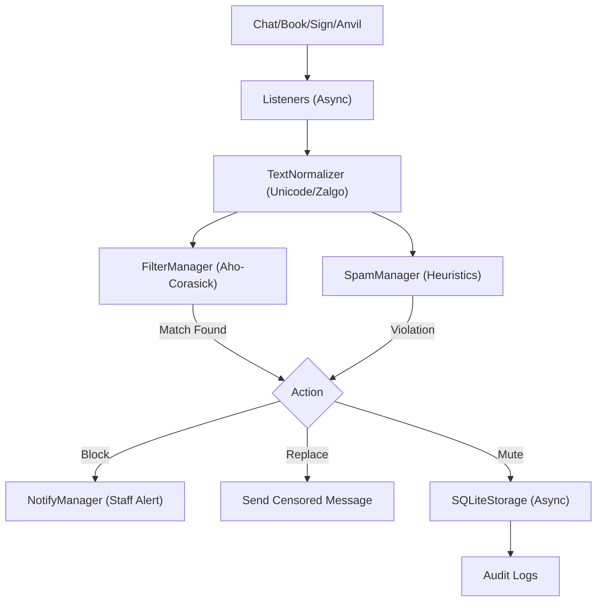

**Version:** 1.0.0 (Paper 1.21.x | Java 21)

**Purpose:** High-performance chat filtering, spam prevention, and player moderation solution using Aho-Corasick algorithms and asynchronous SQLite storage.

---

## Table of Contents

1. [Overview](#overview)
2. [Installation](#installation)
3. [Configuration](#configuration)
4. [Features & Modules](#features--modules)
5. [Commands](#commands)
6. [Permissions](#permissions)
7. [API & Hooks](#api--hooks)
8. [Data Storage](#data-storage)
9. [Developer Function Index](#developer-function-index)

---

## Overview

SparkWord is a modular moderation plugin designed for Paper 1.21.x. It separates responsibilities into three core domains: **Word Filtering**, **Spam Detection**, and **Player Punishment/History**.

### Architecture Flow

---

## Installation

1. **Requirements:**
* Java 21 or higher (Project `pom.xml` properties).
* Paper 1.21.x server (Dependencies include `io.papermc.paper:paper-api:1.21-R0.1`).

2. **Build:**
* Run `mvn clean package`.
* The build includes shaded dependencies: `HikariCP` and `Caffeine` (Relocated to `com.sparkword.libs.*`).

3. **Setup:**
* Place `SparkWord-1.0.0.jar` in `plugins/`.
* Restart server. Config files (`config.yml`, `messages.yml`, `commands.yml`) and `words/` directory are generated automatically.

---

## Configuration

The plugin initializes configuration via `ConfigManager.java` [src/main/java/com/sparkword/core/ConfigManager.java].

| File | Purpose | Location |
| --- | --- | --- |
| `config.yml` | Feature toggles, limits, and behavior settings. | `plugin.getDataFolder()/config.yml` |
| `messages.yml` | Localization strings. | `plugin.getDataFolder()/messages.yml` |
| `commands.yml` | Command alias mapping. | `plugin.getDataFolder()/commands.yml` |
| `words/*.txt` | Filter lists (Normal, Strong, WriteCommand). | `plugin.getDataFolder()/words/` |

### Key Flags (Runtime)

* **Debug Mode:** `debug` (boolean) - Toggles general debug logging.
* **Unicode/Zalgo:** `system-filter.unicode` / `system-filter.zalgo` - Controls `TextNormalizer` behavior.
* **Filter Sources:** `filter-sources.chat`, `signs`, `books`, `anvils` - Toggles listeners.
* **Storage Purge:** `suggestion.purge-hours` - Controls async purge task frequency.

---

## Features & Modules

### 1. Word Filtering

**Class:** `FilterManager.java` [src/main/java/com/sparkword/filters/FilterManager.java]

* **Engine:** Uses Aho-Corasick algorithm (`AhoCorasickEngine.java`) for O(n) text search.
* **Normalization:** `TextNormalizer` removes invisible characters, normalizes Unicode (NFKC/NFKD), and maps confusable characters (e.g., Cyrillic 'а' to Latin 'a') before filtering.
* **Modes:**
  * `NORMAL`: Standard censorship.
  * `STRONG`: Stricter matching.
  * `WRITE_COMMAND`: Filters specific commands.

* **Hot-Swap:** Adding words via command updates the trie structure in memory immediately without full reload.

### 2. Spam Prevention

**Class:** `SpamManager.java` [src/main/java/com/sparkword/spammers/SpamManager.java]

* **Checks:**
  * **Anti-Flood:** Token bucket algorithm (`AtomicTokenBucket.java`).
  * **Anti-Repeat:** KMP algorithm and Levenshtein similarity check (`AntiRepeatCheck.java`).
  * **IP/Domain:** Regex-based detection with obfuscation removal (`DomainCheck.java`, `IPCheck.java`).
  * **IP Split:** Detects IP addresses split across multiple sign lines or chat messages (`IPSplitCheck.java`).
  * **Heuristics:** Caps lock, Character spam, Digit limits.
  * **Injection:** Sanitizes inputs against MiniMessage tags and placeholder injection (`InputSanitizer.java`).

### 3. Moderation & Punishments

**Class:** `MuteRepository.java` / `PlayerDataManager.java`

* **Mute Scopes:** `CHAT` (blocks chat only) vs `GLOBAL` (blocks commands, signs, anvils, books).
* **Persistence:** All punishments are stored in SQLite.
* **Caching:** Active mutes are cached in `MuteCache` (`Caffeine` based) for performance.

### 4. Notifications

**Class:** `NotifyManager.java` [src/main/java/com/sparkword/core/NotifyManager.java]

* **Staff Alerts:** Interactive chat messages with icons indicating violation type (Flood, IP, Filter).
* **Evidence Books:** If a book is blocked, the content is captured into a virtual book accessible via `/sw internal viewbook <id>`.

---

## Commands

All commands are handled by `CommandManager` using Brigadier.
Source: `src/main/java/com/sparkword/commands/CommandManager.java`

### Moderation

| Command | Permission | Usage | Description |
| --- | --- | --- | --- |
| `/sw-mute` | `sparkword.mute` | `<player> <reason>` | Permanently mutes a player (Chat scope). |
| `/sw-tempmute` | `sparkword.tempmute` | `<player> <time> <reason>` | Temporarily mutes a player (e.g., `1h`, `30m`). |
| `/sw-permute` | `sparkword.permute` | `<player> <reason>` | Permanently mutes a player (Global scope - blocks interactions). |
| `/sw-unmute` | `sparkword.unmute` | `<player> [reason]` | Unmutes a player. |
| `/sw-checkmute` | `sparkword.checkmute` | `<player>` | Checks active mute status. |
| `/sw-warn` | `sparkword.warn` | `<player> <reason>` | Issues a warning to a player. |
| `/sw-scan` | `sparkword.scan` | `<player> [page]` | Shows player history (mutes/warnings). |

### Filter Management

| Command | Permission | Usage | Description |
| --- | --- | --- | --- |
| `/sw add` | `sparkword.add` | `<list> <word>` | Adds a word to a filter list (`n`, `s`, `wc`). |
| `/sw remove` | `sparkword.remove` | `<list> <word>` | Removes a word from a filter list. |
| `/sw list` | `sparkword.list` | `<type> [page]` | Lists words or suggestions (`n`, `s`, `wc`, `sg`). |

### Suggestions & Logs

| Command | Permission | Usage | Description |
| --- | --- | --- | --- |
| `/sw-sg` | `sparkword.suggest` | `<word> <reason>` | Players suggest words for blacklisting. |
| `/sw accept` | `sparkword.accept` | `<id> <list>` | Accepts a suggestion and adds it to filter. |
| `/sw deny` | `sparkword.deny` | `<id>` | Denies a suggestion. |
| `/sw audit` | `sparkword.audit` | `<player>` | Views staff action logs. |
| `/sw logs` | `sparkword.logs` | `<type> [page]` | Views violation logs (`b`=blocks, `m`=mutes, `w`=warns). |
| `/sw purge` | `sparkword.purge.logs` | `<type> <days>` | Deletes old data. |

### System

| Command | Permission | Usage | Description |
| --- | --- | --- | --- |
| `/sw info` | N/A | `[page]` | plugin info/help. |
| `/sw reload` | `sparkword.reload` | N/A | Reloads config and filters. |
| `/sw-debug` | `sparkword.debug` | `[filter]` | Toggles debug modes. |

---

## Permissions

**Source:** Checked in `CommandManager.java`, `ChatListener.java`, individual command classes.

| Node | Purpose | Checked In |
| --- | --- | --- |
| `sparkword.admin` | Grants purge all access. | `PurgeCommand.java` |
| `sparkword.notify` | Receives staff alerts/notifications. | `ChatListener.java`, `InternalCommand.java` |
| `sparkword.notify.icon` | Sees spy icons in chat for replaced words. | `ChatListener.java` |
| `sparkword.bypass.chat` | Bypasses chat filtering. | `ChatListener.java` |
| `sparkword.bypass.spam` | Bypasses spam checks. | `SpamManager.java`, `CommandListener.java` |
| `sparkword.bypass.ip` | Bypasses IP regex checks. | `IPCheck.java` |
| `sparkword.bypass.ip.split` | Bypasses IP split checks. | `IPSplitCheck.java` |
| `sparkword.bypass.injection` | Bypasses input sanitization. | `SpamManager.java` |
| `sparkword.bypass.cooldown` | Bypasses suggestion cooldown. | `SuggestCommand.java` |
| `sparkword.bypass.anvils` | Bypasses anvil filtering. | `AnvilListener.java` |
| `sparkword.bypass.books` | Bypasses book filtering. | `BookListener.java` |
| `sparkword.bypass.sign` | Bypasses sign filtering. | `SignListener.java` |
| `sparkword.bypass.symbol.all` | Bypasses Unicode/Zalgo checks. | `FilterManager.java` |
| `sparkword.bypass.writecommands` | Bypasses command spam/filter checks. | `CommandListener.java` |

---

## API & Hooks

**Main API Class:** `com.sparkword.api.SparkWordAPI`

### Public Methods

* `boolean isClean(String text)`
  * Checks if text contains blocked words using currently loaded filters.

* `boolean isClean(String text, Player player)`
  * Same as above, but accounts for player bypass permissions.

* `String filterText(String text)`
  * Returns the text with profanity replaced by the configured replacement string.

* `Component filterComponent(Component text, Player player)`
  * Filters a Paper API Component.

* `void mutePlayer(UUID uuid, String name, int seconds, String reason, boolean global)`
  * Programmatically mutes a player via the plugin's storage system.

### Events

The plugin listens to standard Paper events. It does not currently expose custom events in the repository skeleton provided.

---

## Data Storage

**System:** SQLite
**File:** `database/data.db` (created in plugin folder)
**Pool:** HikariCP
**Implementation:** `SQLiteStorage.java` [src/main/java/com/sparkword/core/SQLiteStorage.java]

### Tables

1. `players`: UUID/Name mapping.
2. `muted`: Active and past mutes.
3. `warnings`: Player warnings.
4. `monitor_logs`: Chat violations and spam blocks.
5. `audit`: Staff actions (ban/mute/purge logs).
6. `suggestions`: User-submitted word suggestions.

---

## Developer Function Index

Selected high-value methods for developers navigating the codebase:

| Method | Class | File:Line | Purpose |
| --- | --- | --- | --- |
| `processText(String, boolean, Player)` | `FilterManager` | `filters/FilterManager.java:108` | Core logic for filtering text. |
| `checkSpam(Player, String, ...)` | `SpamManager` | `spammers/SpamManager.java:79` | Runs all spam checks on input. |
| `findMatches(String)` | `AhoCorasickEngine` | `filters/word/engine/AhoCorasickEngine.java:54` | Performs the Aho-Corasick search. |
| `normalizeForSearch(String)` | `TextNormalizer` | `filters/util/TextNormalizer.java:56` | Prepares text for filtering (lower, NFKC). |
| `mute(int, String, ...)` | `SQLiteStorage` | `core/SQLiteStorage.java:82` | Persists a mute to DB. |
| `notifyStaff(Player, ...)` | `NotifyManager` | `core/NotifyManager.java:55` | Broadcasts alerts to permission holders. |
| `sanitize(String, Player)` | `InputSanitizer` | `spammers/security/InputSanitizer.java:23` | Cleanses MiniMessage tags/injections. |

---

## Logging, Errors & Debugging

* **Logging:** Uses `Bukkit.getConsoleSender()` and `getLogger()`.
* **Debug Mode:** Enable via `/sw-debug` or `config.yml` (`debug: true`).
* Logs filter processing details in `ChatListener` when enabled.
* Logs filter loading/reloading in `FilterManager`.

* **Known Error Handling:**
  * `Environment` initialization failure disables the plugin to prevent data corruption.
  * SQLite migration errors are caught and logged to SEVERE.

---

## Internationalization

* **Status:** Externalized.
* **File:** `messages.yml`.
* **Manager:** `MessageManager.java` uses `MiniMessage` for formatting.
* **Note:** Some log prefixes and audit details are hardcoded in Java classes (e.g., `AuditRepository` SQL strings, `MuteInfo` reasons).

---

## Performance & Security Notes

1. **Async I/O:** All database operations (Mutes, Logs, Lookups) are offloaded to `StorageExecutors` (Writer: Single Thread, Reader: Virtual Thread per task).
2. **Aho-Corasick:** Filtering is O(n) relative to input length, not the number of blocked words, ensuring high performance even with large lists.
3. **Regular Expressions:** `IPCheck` and `DomainCheck` use compiled patterns. `IPSplitCheck` performs string concatenation which is capped at 300 chars to prevent DoS.
4. **Books:** Book editing has a global rate limit (`globalEditsPerSecond`) and specific char limits (`8000`) to prevent packet spam exploits.
